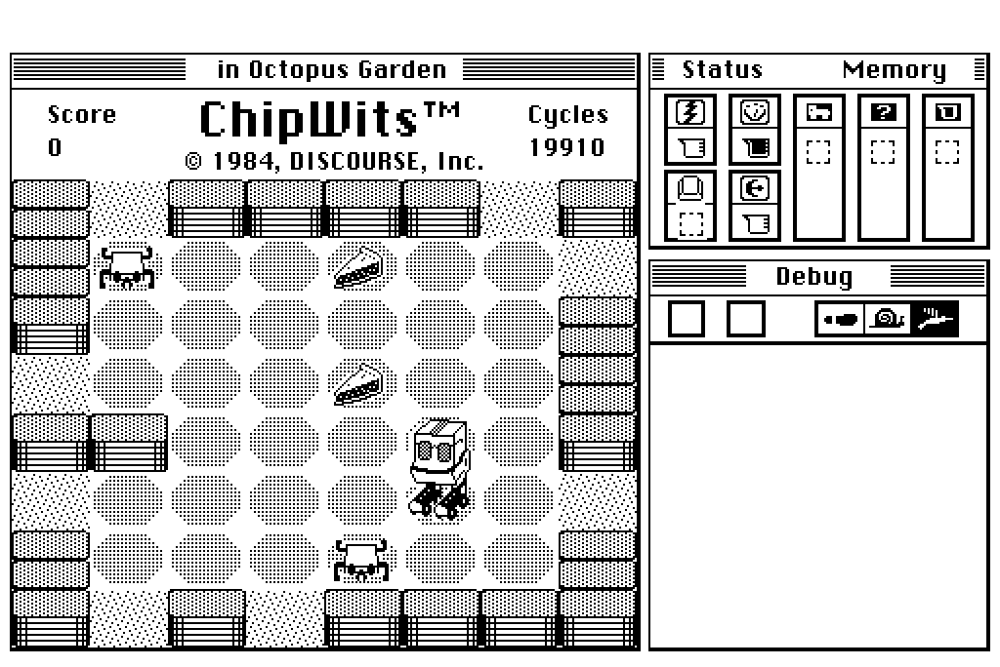

# ChipWits+ native Linux port

The recovered 1984–86 **ChipWits+** MacForth source (see [`../mac/`](../mac/))
compiling and running **natively on Linux** — no emulator. The original Forth
game code is untouched; a compatibility shim replaces MacForth and the Mac
Toolbox, and the recovered data files supply the missions, robots and art.

*The real thing: `Init.ChipWits` + `start.game` running headless on Linux,
drawn by the original game code through a QuickDraw-subset renderer
(`qd.fs`) into a 512×342 1-bit framebuffer, using the recovered
sprite sheets, Doug Sharp's saved robot, and his last-played mission
(Memory Lanes) restored from the recovered stats file.*

## Status

**Playable in the browser:**

    ./setup.sh   # once
    ./play.sh    # game in the terminal, UI at http://localhost:8047

The original master word (`CHIPWITS`) runs the whole show: start missions
from the Games menu, watch the robot run with the live debug trace, open
the Workshop and edit chips with the mouse (`docs/native-linux-workshop.png`
shows Doug Sharp's saved robot program rendered as its wired chip network).
Options > Quit exits cleanly.  The browser page polls the 1-bit framebuffer
(~11 fps) and posts mouse/key/menu events back; `serve.py` is stdlib-only.

- Rendering is real: CopyBits (all four transfer modes), rect/oval/line
  verbs with pen patterns and modes, and bitmap text draw into the screen
  buffer exactly as the original code directs.  The hot loops (CBLIT /
  CFILLPAT) are C primitives compiled into pforth via `pfcustom.c` —
  full startup takes ~0.1 s; `live.fs` paces the game at ~60 events/s.
- Events are pumped MacForth-style: `STILL.DOWN` and `@MOUSE` consume the
  queue themselves, since the game's drag loops poll them without calling
  `DO.EVENTS` (on a Mac the mouse updated by interrupt).
- Menu picks dispatch through `MENU.SELECTION:` handlers in the original
  code (`menu-item`/`menu-mode` + calling the menu word).

**Extracted art** (`assets/`, regenerate with `tools/extract_assets.py`):
all 25 operator chips + 29 argument chips from the IBOL sheet, the robot
in 8 orientations with masks, and both full sprite sheets — 1× pixels,
transparent background, named from the original rect tables.  See
`assets/README.md` for the naming map and license.
- All 184 recovered source screens of `CW+ Work Final Src/ChipWits.forth`
  compile under pforth (32-bit build), with 3 damaged screens filled in from
  `CW Game + Backup Source`.
- The IBOL virtual machine runs: chip fetch/decode, true/false flow wiring,
  MOVE/TURN, FEEL.FOR branching, bump damage, fuel & cycle accounting, and room
  transitions through doors — verified against the real `Greedville` mission file.
- The recovered data files load byte-exactly: rooms (`Greedville` etc., 80-byte
  records), saved robots (`CW`, 16×1200 bytes), the sprite sheet
  (`Source Graphics`, 368×232×1-bit) and chip icons (`IBOL`, 160×160×1-bit) —
  their sizes match the code's `source.len`/`ibol.len` constants exactly.

**Not yet done:** PICT decoding for per-adventure floor tiles
(`new.interior` — the sprite sheet's baked-in tiles are used meanwhile),
proportional Mac font metrics (text is an 8×8 font, so wide strings run a
little long), sound, and websocket push instead of frame polling.

## Quick start

    ./setup.sh      # builds 32-bit pforth (needs gcc-multilib), generates
                    # screens/ from ../mac/forth, copies data files
    ./run-test.sh   # headless VM smoke test: a wall-following robot

Expected output: the robot feels a wall, turns, walks across the room square
by square and exits through a door, with fuel/cycle/damage counts matching the
original game's tables (MOVE = 3 cycles / 5 fuel, bump = 50 damage).

## Layout

- `macforth-shim.fs` — MacForth/Toolbox compatibility layer for pforth
- `qd.fs` — the renderer: 1-bit bitmaps, patterns, CopyBits, 8×8 bitmap text
- `pfcustom.c` — C blitter primitives (CBLIT/CFILLPAT), built into pforth
- `font8x8.fs` — public-domain 8×8 font (Marcel Sondaar / Daniel Hepper)
- `loader.fs` — replaces SCREEN 001 (the Robotnik loader); compiles the game
- `live.fs`, `serve.py`, `play.sh` — the playable browser bridge
- `split_screens.py` — splits `ChipWits.forth` into `screens/NNN.fs`
- `tools/extract_assets.py`, `assets/` — the reusable art (see above)
- `test-vm.fs` — headless VM smoke test
- `test-render.fs` — full startup + gameplay, saving PBM screenshots
- `screens/`, `data/`, `pforth/`, `live/` — generated (gitignored)

## MacForth dialect notes (hard-won)

- 32-bit cells everywhere; `,`/`w,`/`c,` build unpadded 68k structs (the shim
  redefines them; pforth must be a 32-bit binary: `make CC="gcc -m32"`).
- `PICK`/`ROLL` are fig-style 1-based.
- `'` returns a *patchable body address* and binds at compile time inside `:` defs
  (the source patches constants with `' name !`).
- `I+`, `IC@`, `IC!` are fused loop-index words (`I +`, `I C@`, `I C!`) —
  implemented as immediate macros.
- Interpret-level `EXIT` skips the rest of a screen. The final source uses this
  deliberately to disable superseded code (old chord-based sounds on screen 023,
  `voc.chop`/`transient.allot` on 178–179, the old chooser on 183–186) — the
  splitter strips it; do not resurrect those versions.
- `SCROLL ( rect dx dy rgn -- )`, `MAKE.RECT ( x1 y1 x2 y2 -- pBR pTL flag )`,
  `BINARY.CONTROL ( wind x y title$ value kind -- ctl )`, `WINDOW ( w -- )` =
  make w the current port.
- A Rect is 4×int16 `t,l,b,r`; a Point is the 32-bit fetch of `t,l`
  (x = high 16 bits, y = low 16 bits on a little-endian host).
- A-traps are defined in screen 076 via `mt`/`w>mt`/`2w>mt`/`func>l`; the shim
  dispatches on trap number (OffsetRect is implemented for real, CopyBits is
  arity-faithful and awaits the rendering pass).
- Screen 016 redefines `WITHIN` and `MOD` (always-positive) — load order handles it.
- File channels: 4 = stats (in `"CW"`), 5 = `IBOL`, 6 = `CW` robots,
  8 = mission file, 7 = ad-hoc. `READ.FIXED ( addr rec# f# )` uses
  `SET.REC.LEN`; mission records are 80 bytes, record index = room number
  (record 0 unused).
- `RECTANGLE`/`OVAL` take two *corner points* `( x1 y1 x2 y2 verb -- )` in any
  corner order (that is what `rect>rectangle` produces); the verbs are
  `FRAME PAINT CLEAR INVERT` — yes, `INVERT` the QD verb shadows bitwise
  invert, and the game never uses the bitwise one.
- `MENU.SELECTION:` splits a definition: everything after it is that menu's
  handler `( item# -- )`, which must NOT run during setup — the shim ends the
  word there with a return-stack pop, and can re-enter in dispatch mode.
- TextEdit words use one implicit record: `TERECORD ( wind -- te )`,
  `TESET.TEXT ( addr len -- )`, `TEACTIVATE/TEIDLE ( -- )`; the game peeks
  TERec offsets +60 (teLength) and +62 (hText handle) directly.
- The re-encoded source writes MacRoman high-ASCII as `{$XX}`; the splitter
  restores the single byte so string lengths (and centering math) stay exact.
- The game assumes a classic Mac app's **zeroed fresh memory**
  (`bouncer.state`, `robot.program`, ...) — the shim zeroes everything
  `VARIABLE` and `ALLOT` hand out, or uninitialized state walks into wild
  rect writes.
- `PREP.ARM` leaves `facing` on the stack (its `( --- )` comment lies);
  `MOVE.ARM`'s loop limit multiplies by it.  Trust the stack, not the comments.
- pforth gotcha: a second `{ ... }` locals block mid-definition compiles
  silently but corrupts execution — one block per word.
